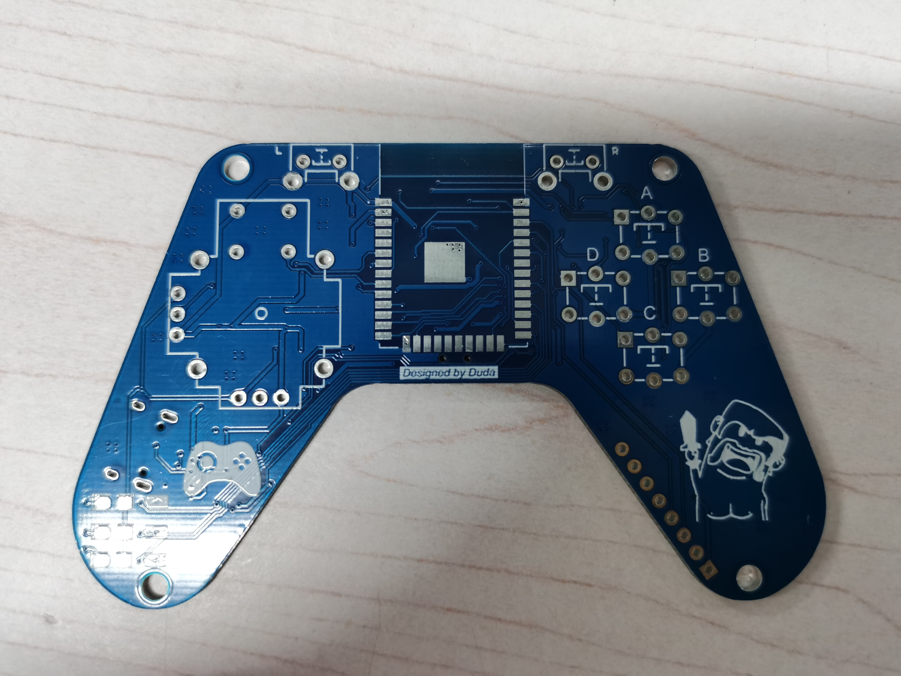

# 基于ESP32的蓝牙小手柄 | 附Arduino源码

 在B站看到了UP主皇工小毒仔的的视频感觉很有意思，可以拿来打原神，于是把他复现了出来由于UP主并没有开源代码，于是我把我的代码和UP主开源的网址一并发出供参考

[皇工小毒仔的Git库](https://gitee.com/dudaso/bluetooth-gamepad)

[我的Git库](https://gitee.com/xinyu0077/ESP32-Smart-handle)

[演示视频](https://www.bilibili.com/video/BV1AY411a7WE)

我的代码是基于UP主的板子进行调试的，有很多资料在UP主的库里面都有提及

## 代码部分

我把代码分为了两部分 一部分为连接电脑实现蓝牙手柄按键的功能 另一部分UP主使用摇杆控制小车移动的功能（UP主用的是MPU6050但我买回的来MPU6050有些问题我就放弃了你们也可以尝试一下） 你们也可以将两个代码合到一起通过按键切换 不过我没写 因为按键真的不够用啊= =

### 蓝牙键盘手柄

我想试着用这个手柄来打原神，但这样就需要esp32同时模拟鼠标和键盘，当我尝试这样做的时候我发现这两个不能同时使用，所幸的是蓝牙键盘库和蓝牙鼠标库的作者Github库里的lssues区有个大佬将这两个库整合起来了，这个组合库和单独的库我都会放进我的Git库里面


下面我们来看代码,此处用到的简单定时器我也会放进我的Git库里面的

```arduino
void setup() {
  // put your setup code here, to run once:
  Serial.begin(115200);//初始化波特率为115200
  Keyboard.begin();// 蓝牙键盘初始化
  Mouse.begin();//蓝牙鼠标初始化
  Serial.println("Starting BLE Keyboard&Mouse!");//串口打印信息

  pinMode(33, INPUT_PULLUP); //设置摇杆SW为上拉输入模式
  pinMode(34, INPUT);//摇杆34,35脚设置为输入模式
  pinMode(35, INPUT);

  //此处配置按键为输出模式并设为高电平
  pinMode(14, OUTPUT);
  digitalWrite(14, HIGH);
  pinMode(25, OUTPUT);
  digitalWrite(25, HIGH);
  pinMode(26, OUTPUT);
  digitalWrite(26, HIGH);
  pinMode(27, OUTPUT);
  digitalWrite(27, HIGH);
  pinMode(4, OUTPUT);
  digitalWrite(4, HIGH);
  pinMode(19, OUTPUT);
  digitalWrite(19, HIGH);

  timer.setInterval(0.001L, Simple_timer_1);//设置一个简单定时器1  1L=一毫秒
  Serial.println("Init OK!");
}
```

setup里面打开蓝牙键盘和鼠标，初始化简单定时器并打开它，因为我用的是整合库，所以我并没有像单独使用键盘和鼠标一样去初始化名字电量这些，如果你想改请使用BleComboKeyboard函数，因为他的组合库是以键盘形式来链接蓝牙的，但也可以操作鼠标，因为我修改的是.h文件里的默认值，所以我就没有添加这个函数

```arduino
void Simple_timer_1() {
  //简单定时器1
  //读取按键和摇杆IO口的电平
  KeyUp     = digitalRead(25);
  KeyDown   = digitalRead(27);
  KeyLeft   = digitalRead(14);
  KeyRight  = digitalRead(26);
  Key_Front_Left = digitalRead(4);
  Key_Front_Right = digitalRead(19);
  JoyX = analogRead(35);
  JoyY = analogRead(34);
  JoySW = digitalRead(33);
}
```

简单定时器里面就一直读取引脚电平，直接放到loop里面从而不使用定时器也行，但我更喜欢loop里面更少的代码

```arduino
 void joy() {
  //摇杆函数 进入函数执行摇杆的一系列操作 此处可以自由发挥
  //判断摇杆y轴状态 JoyY这里定义>3500表示正推 <350表示反推
  if (JoyY > 3500)
  {
    Mouse.move(0, -1);//Mouse.move函数控制鼠标移动
    Serial.println("joyUp");
  }
  else if (JoyY < 350)
  {
    Mouse.move(0, 1);
    Serial.println("joyDown");
  }
  //判断摇杆x轴状态 JoyX这里定义>3500表示正推 <350表示反推
  if (JoyX > 3500)
  {
    Mouse.move(-1, 0);
    Serial.println("joyLeft");
  }
  else if (JoyX < 350)
  {
    Mouse.move(1, 0);
    Serial.println("joyRight");
  }
  //判断摇杆按钮状态 当按钮被按下，读取值为0
  if (JoySW == 0) {
    Genshin = 1;//切换为原神模式0w0
    while (JoySW == 0) {
      JoySW = digitalRead(33);
    }
    Serial.println("joyPress");
  }
}
```

joy是摇杆函数此处的3500和350是通过读取引脚的AD值得到的，每种型号的开发板读取到的值貌似不一样，我只试了UNO和ESP32，UNO就一直稳定在400多，当正推时会达到600多，所以就可以设置大于600时为正推，发推都为0，但esp32并不一样，当你没任何操作时它会稳定在2000左右，正推时可以达到4000多，于是我设置为大于3500为正推，小于350为反推

按键函数就不放了，大家伙都会

```arduino
void loop() {
  // put your main code here, to run repeatedly:
  timer.run();//运行简单定时器
  if (Keyboard.isConnected()) {
    //通过 Keyboard.isConnected() 来判断ESP32是否与电脑连接成功，如果没有连接，写在这里面的程序是不会执行的，只有在电脑与ESP32配对连接之后，里面的程序才会执行。
    // codes here...
    if (Genshin == 0) {
      joy();
      key();
    }
    else if (Genshin == 1) {
      joy_Genshin();
      key_Genshin();
    }
  }
}
```

我就喜欢这样的loop函数，很简洁，Genshin是我写的原神模式

### 摇杆遥控小车部分

这里我又准备了一块esp32开发板，和小车进行连接，这两块esp32通过wifi模块和ESP-NOW协议进行数据通信 这里放一下ESP-NOW协议的官网 可以去看一下 

[ESP-NOW](https://randomnerdtutorials.com/esp-now-esp32-arduino-ide/)

```arduino
#include "WiFi.h"
 
void setup(){
  Serial.begin(115200);
  WiFi.mode(WIFI_MODE_STA);
  Serial.print("MAC地址为：");
  Serial.println(WiFi.macAddress());
}
 
void loop(){

}
```

通过这串代码获取接收板的MAC地址 使发送板能与之通信


以下代码是发送板代码

记录下你的MAC地址将其填到uint8_t broadcastAddress[] = {0xFF, 0xFF, 0xFF, 0xFF, 0xFF, 0xFF};里面

```arduino
// 此处为接收的ESP32的MAC地址
uint8_t broadcastAddress[] = {0xFF, 0xFF, 0xFF, 0xFF, 0xFF, 0xFF};

// 发送数据的结构示例
// 必须匹配接收器结构
typedef struct struct_message {
  int control;
  int pwm;
} struct_message;

// 创建一个名为myData的struct_message的数据结构
struct_message myData;

// 当数据发送时回调
void OnDataSent(const uint8_t *mac_addr, esp_now_send_status_t status) {
  Serial.print("\r\nLast Packet Send Status:\t");
  Serial.println(status == ESP_NOW_SEND_SUCCESS ? "Delivery Success" : "Delivery Fail");
}
```

```arduino
void setup() {
  Serial.begin(115200);
  // 将设备设置为Wi-Fi站
  WiFi.mode(WIFI_STA);

  // 初始化 ESP-NOW
  if (esp_now_init() != ESP_OK) {
    Serial.println("Error initializing ESP-NOW");
    return;
  }

  // 一旦ESPNow成功初始化，我们将注册Send CB来获取发送报文的状态
  esp_now_register_send_cb(OnDataSent);

  // Register peer
  esp_now_peer_info_t peerInfo;
  memcpy(peerInfo.peer_addr, broadcastAddress, 6);
  peerInfo.channel = 0;
  peerInfo.encrypt = false;

  // Add peer
  if (esp_now_add_peer(&peerInfo) != ESP_OK) {
    Serial.println("Failed to add peer");
    return;
  }
  myData.control = 0;//0:stop 1:run 2:back 3:left 4:right
  myData.pwm = 75;
  pinMode(33, INPUT_PULLUP); //设置摇杆SW为上拉输入模式
  pinMode(34, INPUT);//摇杆34,35脚设置为输入模式
  pinMode(35, INPUT);
  pinMode(25, OUTPUT);
  digitalWrite(25, HIGH);
  pinMode(27, OUTPUT);
  digitalWrite(27, HIGH);
}
```

初始化里面很多设置函数 在官方网站里面都有讲 我们会用就行

以下代码是接受板代码

```arduino
//此处简单定时器的作用为PWM控制小车移速
void Simple_timer_1() {
  pwm = pwm + 1;
  if (pwm == 255) {
    digitalWrite(ENA1, HIGH);
    digitalWrite(ENA2, HIGH);
    pwm = 0;

  }
  if (pwm == myData.pwm) {
    digitalWrite(ENA1, LOW);
    digitalWrite(ENA2, LOW);
  }
}
```

这里的myData.pwm是发送板发送来的数据 来进行控速

```arduino
// 当接收到数据时执行的回调函数 当接受到数据时才会运行以下函数
void OnDataRecv(const uint8_t * mac, const uint8_t *incomingData, int len) {
  memcpy(&myData, incomingData, sizeof(myData));
  if (myData.control == 0) {
    car_stop();
    Serial.println("stop");
  } else if (myData.control == 1) {
    car_run();
    Serial.println("run");
  } else if (myData.control == 2) {
    car_back();
    Serial.println("back");
  } else if (myData.control == 3) {
    car_left();
    Serial.println("left");
  } else if (myData.control == 4) {
    car_right();
    Serial.println("right");
  }
}
```

这里就是通过发送板发送来的myData.control的值来判断小车的运动

到此为止你就拥有了一个基本智能的手柄 自己拿来娱乐还是很不错的 我再夸一句皇工小毒仔的PCB画的真的很好 很细 我感觉很不错很Nice 开出来是这个样子的 不是很大 大约巴掌大小


